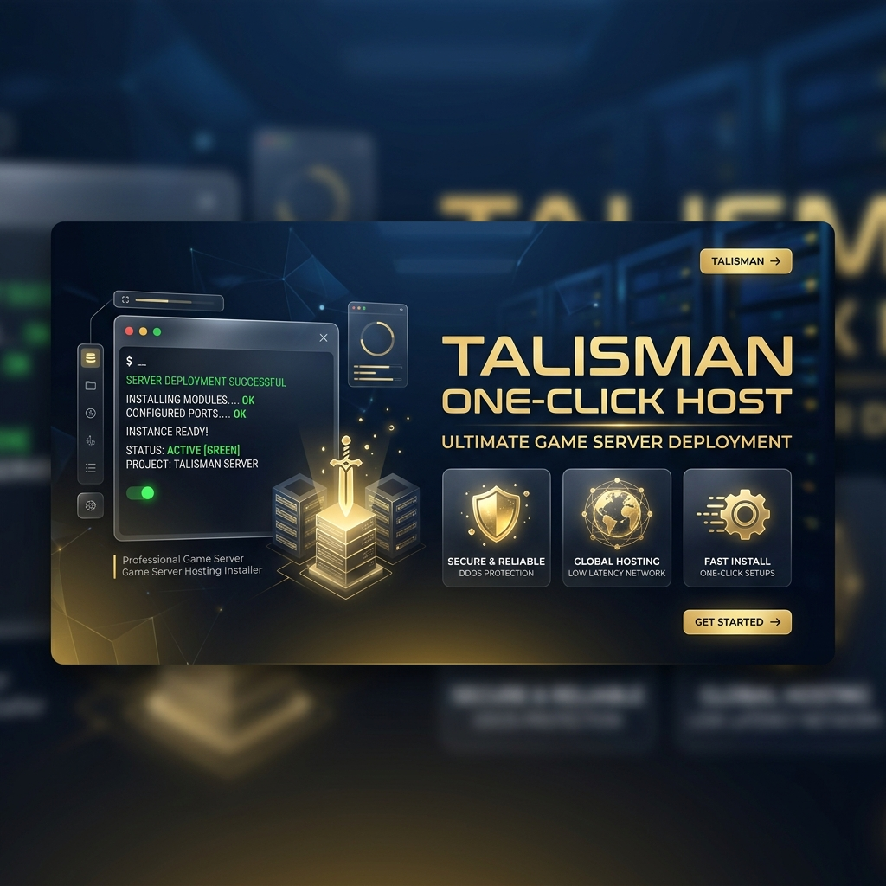

# 🚀 Talisman One-Click Server Host



Welcome to the official **Talisman Universal Game Server Installer**. This repository provides everything you need to turn a fresh Ubuntu or CentOS VPS into a high-performance, secure Game Server with a fully functional website.

---

## 🌟 Key Features
- **Auto-Stack**: Installs PHP 7.4, Apache, and MySQL automatically.
- **SSL Ready**: Pre-configured SSL certificates for secure HTTPS access.
- **Anti-DDoS**: Integrated subnet flood protection and port unblockers.
- **One-Click Deploy**: Automatically clones and sets up the latest website distribution.

---

## 🛠️ Quick Start (One-Line Install)

Run this command on your fresh VPS as **root**:

```bash
curl -sSL https://raw.githubusercontent.com/tdarkscorpion/host/main/setup.sh | bash
```

---

## 📖 Step-by-Step Instructions

### 1. Prepare your VPS
Get a VPS with **Ubuntu 20.04+** or **CentOS 7/8**. Make sure you have root access.

### 2. Run the Installer
Copy the command above and paste it into your terminal.

### 3. Provide Credentials
The installer will ask you for:
- **MySQL Root Password**: Choose a strong password.
- **Authorized Domain**: Your domain name or IP address.

### 4. Wait for Magic
The installer will handle the rest! It will install the stack, secure the firewall, and deploy your website.

---

## 🖼️ Visual Guide

### 📂 Repository Structure
- `setup.sh`: The main brain of the installation.
- `anti_flood.sh`: Protects your server from massive connection attacks.
- `mto.pem/key`: Your secure SSL encryption keys.

### 🛡️ Security Hardening
The installer automatically configures:
- **IPTables**: Only essential ports (22, 80, 443, 81) are open.
- **SYN Cookies**: Prevents TCP SYN flood attacks.
- **Fail2Ban**: Automatically blocks brute-force attempts.

---

## ⚠️ Important Notes
- **PHP Version**: This installer uses PHP 7.4 for maximum compatibility with the Talisman engine.
- **Firewall**: If you use an external firewall (like AWS or Google Cloud), ensure ports **80, 443, and 81** are open in their dashboard.

---

## 👨‍💻 Created By: DarkScorpion

If you need to make a payment, whitelist your domain, or need technical support, please contact me directly:

- **Facebook:** [fb.me/darkscorpiont](http://fb.me/darkscorpiont)
- **Developer:** DarkScorpion

> [!IMPORTANT]
> **Domain Whitelisting Required:** This website will only function on authorized domains. Contact DarkScorpion on Facebook to register your server's domain.

---

*Built with ❤️ for the Talisman Community by DarkScorpion.*
