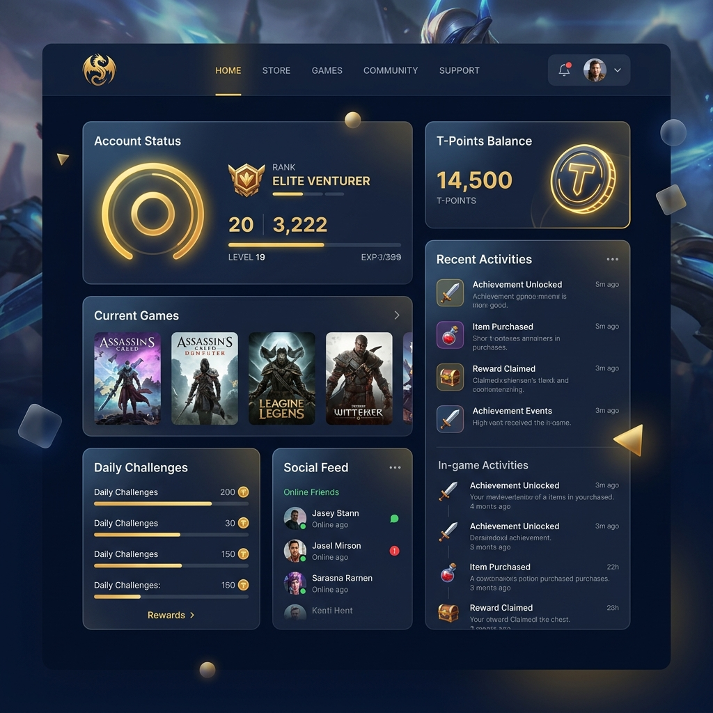
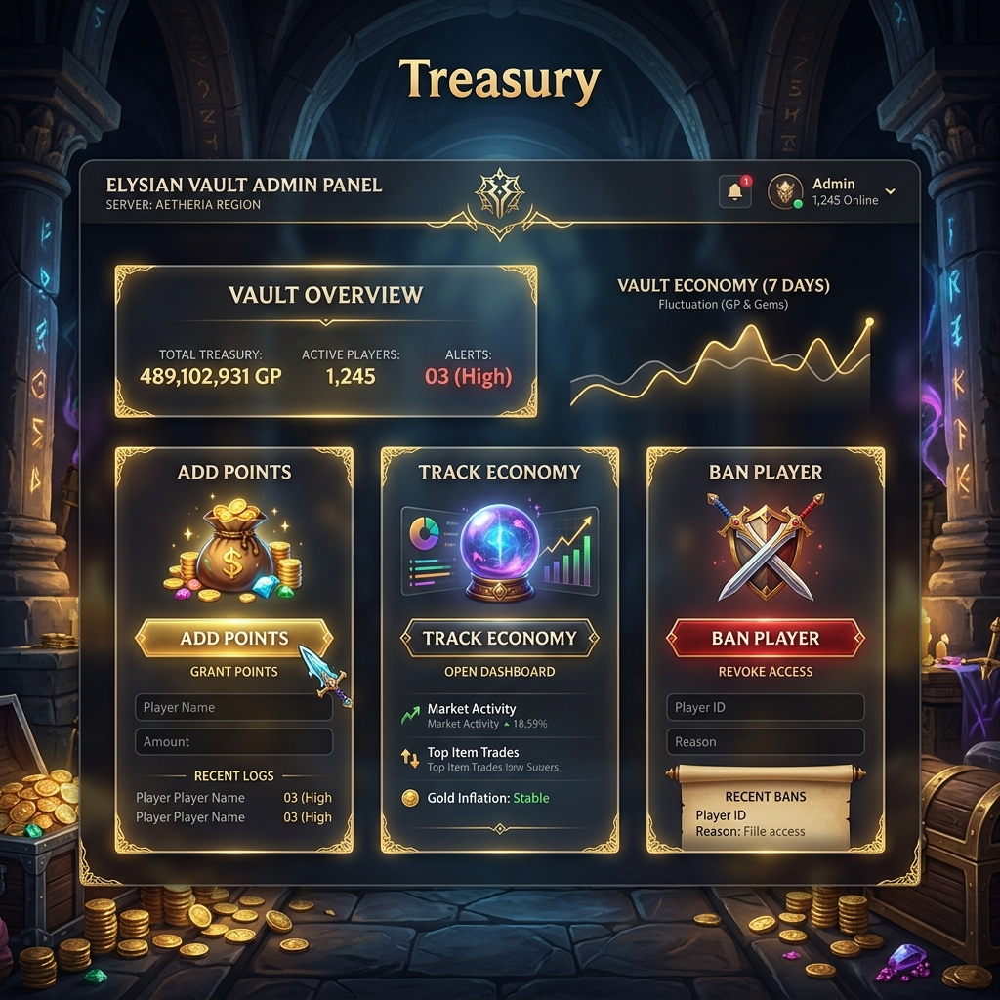

# 🚀 Talisman One-Click Server Host: Ultimate Edition 🚀



Welcome, Server Owner! You have found the official **Talisman Universal Game Server Installer**. This isn't just a script; it's your portal to a professional, high-performance game server environment.

---

## ⚡ Level Up Your Server Deployment

Stop wasting hours setting up LAMP stacks and configuring databases. Our **One-Click Engine** handles the heavy lifting so you can focus on your community.

### 🛑 End the phpMyAdmin Nightmare
Tired of manually editing the `gd` column in **phpMyAdmin** just to give a player their coins? 
- **Automated Economy**: The integrated website allows you to manage points, track donations, and reward players directly from a premium dashboard.
- **Zero Stress**: No more manual SQL queries or risky table edits.

---

## 🌟 Key Features
- **Auto-Stack**: Installs PHP 7.4, Apache, and MySQL automatically.
- **SSL Guard**: Pre-configured security for secure HTTPS access.
- **Anti-DDoS**: Integrated flood protection to keep your server online.
- **Premium Website**: Automatically deploys the latest glassmorphic management panel.

---

## 🎮 Live Interactive Demo

See the management panel in action before you install. This is the exact website that our One-Click Engine will deploy for you.

- **Demo Link:** [http://himeshhome.casa:8082](http://himeshhome.casa:8082)
- **Test Username:** `testuser3`
- **Test Password:** `password123`

---

---

## 🛠️ Quick Start (One-Line Magic)

Run this command on your fresh VPS as **root**:

```bash
curl -sSL https://raw.githubusercontent.com/tdarkscorpion/host/main/install.sh | bash
```

---

## 🛡️ Administrative Power


The deployed website gives you a **Staff Vault** where you can:
- **Add Points Instantly**: No database knowledge required.
- **Manage Characters**: Handle bans and player issues with ease.
- **Monitor the Economy**: See live rankings of the wealthiest players.

---

## 👨‍💻 Created By: DarkScorpion

This engine is forged for elite server owners. For payments, activation, and whitelisting:

- **Facebook:** [fb.me/darkscorpiont](http://fb.me/darkscorpiont)
- **Developer:** DarkScorpion

> [!IMPORTANT]
> **Domain Whitelisting Required:** The management website requires an authorized domain. Contact DarkScorpion on Facebook to register.

---

*Forged with ❤️ for the Talisman Community by DarkScorpion.*
